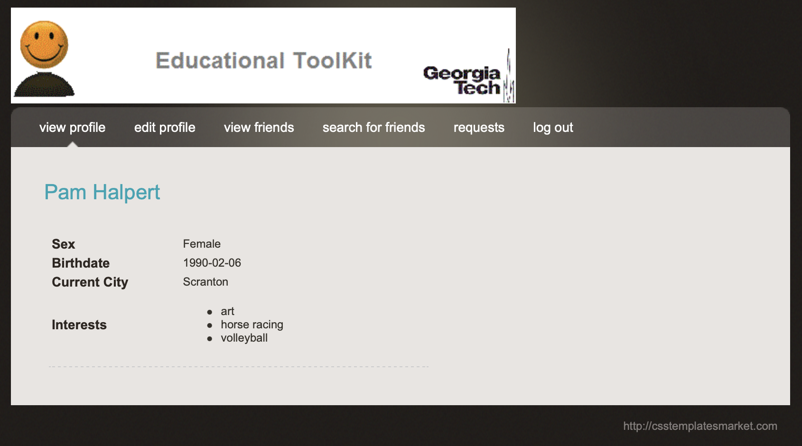

# SADatabasesGTOnline

## Demo

## Udacity course

https://www.udacity.com/course/database-systems-concepts-design--ud150

## Study notes

https://docs.google.com/document/d/1BPgQ-IfgU_jfDsqtB2EpbleAhGite7w2No5-tEnY5Sg/edit

## Other resources

https://github.com/xintao0202/Gatech_Database-system.git
